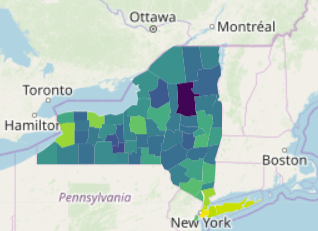

```{r setup, include=FALSE}
knitr::opts_chunk$set(echo = TRUE)
```
# Package Overview


## Summary

As we all know, data visualization is critical in understanding and communicating about data. While static graphs are effective in conveying the thought processes and conclusions of the data scientist who made them, they could potentially miss the mark in addressing questions that an end user needs answered. However, what if we could make graphs that were interactive, allowing a user to personally dive deeper into the data? This is the goal of the R package `plotly`. 

`plotly` is a data visualization tool that focuses on creating interactive, accessible, and visually appealing data models. It extends the functionality of the `ggplot2` package by creating more engaging visuals with roughly the same level of syntax. It also has many advanced features that base `ggplot2` does not have, which will be covered later.

## Background

“Plotly” is actually also the name of the company, which makes the JavaScript graphing library `plotly.js`. The R package `plotly` simply interfaces with this library, allowing it to be used with R data/syntax. Naturally, this means that the functionality of `plotly.js` is also accessible in other languages, including its native JavaScript, Python, and even MATLAB.  

### Version History

Current version: 4.9.2 (last updated 2/12/20)

The earliest available version in [the CRAN package archive](https://cran.r-project.org/src/contrib/Archive/plotly/) is version 2.0.2 (released 11/17/15)

### Dependencies

R (≥ 3.2.0), ggplot2 (≥ 3.0.0)


### Usage

Forms of interaction:

- Zoom in/out
- Adjust axes
- Select only certain data points for closer inspection
- Hide irrelevant data points from the graph

Supported visual formats:

- Basic charts (scatter plots, bar charts, pie charts. etc.)
- Statistical charts (histograms, box plots, etc.)
- Scientific charts (contour plots, heatmaps, etc.)
- Maps (choropleth, geospatial graphs)
- 3D charts (lines, scatter, surface, etc.)
- Custom controls (buttons, dropdowns, sliders)
- Animations


# Examples of Usage

## Scatterplot
This example uses the dataset from the Economist used in the lab.
```{r, include=FALSE}
library(tidyverse)
library(readr)
library(plotly)
library(ggrepel)
```

```{r, message=FALSE, cache=TRUE }
econ_data <- read_csv('EconomistData.csv')
```

### Making a graph from scratch

```{r,echo=TRUE, message=FALSE, warning=FALSE, cache=TRUE }

# We first create our base plot_ly object with parameters for our data.
# This is almost identical to ggplot2.
fig = plot_ly(
  data=econ_data, 
  x=~CPI, y=~HDI, 
  type="scatter", # We specify our graph type here instead of adding a geom object
  mode="markers",
  color = ~Region, # Tildes are used to access columns in our dataframe in plot.ly
  colors ="Set1", # Specifies our color palette
  text=paste( #This formats our hover text in the interactive graph
    econ_data$Country, 
    "\nCPI: ", econ_data$CPI, 
    "\nHDI ",econ_data$HDI),
  hoverinfo="text") %>% 
  
  # plot.ly also takes advantage of the pipe operator, so we can modify features of our graph below. This is also almost identical to ggplot2.
  layout(
    title = 'Corruption and human development', 
    xaxis = list(title="Corruption Perceptions Index, 2011 (10=least corrupt"),
    yaxis = list(title="Human Development Index, 2011 (1=best)"))
```
```{r, echo=FALSE}
fig
```

### Converting from ggplot2 
```{r, echo=FALSE, message=FALSE, warning=FALSE, cache=TRUE }
# The following code is from the ggplot lab and is not necessarily part of our project.

# This changes the labels for the econ_data dataframe
curr_labs = c("EU W. Europe","Asia Pacific","MENA","SSA","East EU Cemt Asia")
new_labs = c("OECD","Asia & Oceania","Middle East & north Africa","Sub-Saharan Africa",
             "Central & Eastern Europe")
change_labs = function(df, curr, new){
  df %>% mutate_if(is.character, str_replace_all, pattern = curr, replacement = new)
}
for(index in c(1:length(curr_labs))){
  econ_data = change_labs(econ_data, curr_labs[index], new_labs[index])
}

# Labels for the countries.
countries = c("Russia", "Venezuela", "Iraq", "Myanmar", "Sudan", "Afghanistan", "Argentina",
              "Congo", "Greece", "Brazil", "India", "Italy", "China", "South Africa", "Rwanda",
              "Cape Verde", "Bhutan", "Botswana", "Spain", "France", "US", "Germany", "Britain",
              "Japan", "Barbados", "Norway", "Singapore", "New Zealand")

# This creates our ggplot object with the correct variables
plot = ggplot(data=econ_data,
              aes(x=CPI, y=HDI)) +
  theme_bw()

# This changes the shape and size of each point in the scatterplot
plot = plot +
  geom_point(aes(color=str_wrap(Region,15),
                 text=paste(Country, "\nCPI: ", CPI, "\nHDI ",HDI)), 
             size = 3, 
             shape = 1, 
             stroke = 0.5)

# Adds labels to the countries that are labeled in the original graph
plot = plot +
  geom_text_repel(data=subset(econ_data, Country %in% countries), 
                  aes(label=Country),
                  color="black", point.padding = T)

# Scales and formats the axes
plot = plot +
  scale_y_continuous(breaks=seq(0.2, 1, 0.1),
                     limits=c(.2,1.0)) +
  scale_x_continuous(breaks=seq(1,10),
                     limits=c(1,10)) +
  theme(panel.grid.minor.y = element_blank(),
        panel.grid.major.x = element_blank(),
        panel.grid.minor.x = element_blank(),
        panel.border = element_blank())

# Sets the colors of the points to the hex values of the colors in the original graph
plot = plot +
  scale_color_manual(values = c("#3eb7e0", "#91daf3", "#3ea69e",
                                "#f58171", "#1b5e73", "#9d5743"))

# Changes the graph and axis titles
plot = plot +
  labs(x = "Corruption Perceptions Index, 2011 (10=least corrupt)",
       y = "Human Development Index, 2011 (1=best)",
       title = "Corruption and human development") +
  theme(plot.title = element_text(face="bold"))

# Formats and positions the legend of the graph.
plot = plot + 
  theme(legend.position = "top",
        legend.title = element_blank()) +
  guides(color = guide_legend(nrow = 1))

# Runs a linear regression model between HDI and the log of CPI.
mod <- lm(HDI ~ log(CPI), data = econ_data)
r2 <- broom::glance(mod) %>% pull(r.squared) %>% round(., 2) #calculates r^2

# Plots our r^2 value onto to the graph
plot = plot +
  geom_smooth(method = 'lm', formula = y ~ log(x), se=F, color = "#ed1b22") +
  annotate(geom = 'text',
           x = 9, y = .5,
           label=glue::glue("R^2 == {r}",r=r2),
           size=5,
           parse=T, color = "#ed1b22")
```

#### Original `ggplot2`:
```{r, echo=FALSE, message=FALSE, warning=FALSE, cache=TRUE }
plot
```

#### `plotly` version:
```{r, message=FALSE, warning=FALSE, cache=TRUE }
# This function converts our ggplot object "plot" into a plot_ly object.
ggplotly(plot, tooltip="text") # "text" is an attribute set in geom_point
```


## Map

```{r, message=FALSE, cache=TRUE }
cv = read_csv("coronavirus.csv") # Reads in our data

# We construct a basic plot_ly object as in the previous example
plot_ly(
  data = cv, 
  type="choropleth", # We just have to change our graph type to get a map
  locations=~Country, 
  locationmode="country names", # Specifies what labels to look for in our data
  z=~Cases, # Determines the color gradient based on how many cases of coronavirus have occurred in that country
  colors="Reds") %>% 
  # Changes the scope/scale of our map to the entire world and adds a title
  layout(
    geo=list(scope="world"),
    title="Coronavirus Cases as of March 4, 2020")

```

## Animations

```{r, message=FALSE, cache=TRUE}
beaches = read_csv("sydneybeaches3.csv") # Loads beaches dataset
beaches$month = as.factor(beaches$month) # Converts month from numeric to factor

# Creates a plot_ly bar graph
plot = plot_ly(
  data=beaches,
  x=~month, 
  y=~temperature, 
  frame = ~year, 
  type="bar",
  transforms = list( # transforms is essentially a parameter that provides simple data cleaning functionality
    list(
      type = 'aggregate', # We specify this parameter to aggregate data points in the same month
      groups = ~month, 
      aggregations = 
        list(
          list(
            target = 'y', # Sets this as our new y
            func = 'avg', # Specifies that we want the mean of our aggregated data
            enabled = T
          )
        )
    )
  )
) %>%
  animation_opts(
    frame=2000, # Adjusts how long the animation stays on each frame
    transition=1000, # Adjusts the animation speed between each frame
    easing="linear", # Adjusts the animation type
    redraw = FALSE) %>% # Does not redraw the entire graph between frames 
  # Labels our graph
  layout(
    showlegend=FALSE, 
    xaxis=list(title="Month"),
    yaxis=list(title="Temperature"), 
    title="Average Temperature per Month over Time")

plot

```

# Similar Packages

### `ggplot2`
The most obvious comparison can be drawn between `plotly` and `ggplot2`, considering that you can literally convert from `ggplot2` to `plotly`. In our experience, simply plotting a graph with either package is roughly the same in difficulty  However, `plotly` offers a wider range of features and better aesthetic customization. More subjectively, we think that graphs generated with `plotly` tend to be more visually appealing than `ggplot2`. 


### `leaflet`
In our `plotly` map, there were not many customization options for the scaling. As far as we could tell, out of the box there were only options for the US, continents, and the entire world. If there were more customization options, the documentation did not clearly state it, and there weren’t any sources we could find that indicated that there were other options. `leaflet`, on the other hand, is a package dedicated to creating interactive mapping visuals. Like `plotly`, it features interactable maps, but also contains numerous additional layers which can be added with similar syntax to `ggplot2`, such as:

- Map tiles
- Markers
- Polygons
- Lines
- Popups





# Reflection

Some features can be finicky — for example, when figuring out how to set up the tooltips for converting the Economist graph, changing the hovertext on the data points had to be done in 2 different ways, depending on if the graph was made entirely with `plotly` or by converting from `ggplot2`. 

However, by far our biggest struggle with `plotly` was poor documentation. Documentation for `plotly` is hosted on their own website, which is split into two different sections. The main documentation is composed of a series of brief examples for the various graphs. While this can be helpful for simple plots, the examples don’t convey enough information to be useful for advanced customization and features. 

At the same time, there’s a **separate** reference page that solely lists all the parameters without any examples, so it is hard to understand what exactly the parameters should be set to. Additionally, some fields like color scale on the choropleth have certain presets like "YlGnBu" that you can't use unless you happen to know exactly what string the preset is. Of course, this information is not particularly easy to come by. It also doesn’t help that the developers of `plotly` use the exact same name for their package on every platform, so oftentimes searching for guidance using the R package `plotly` yielded completely unhelpful advice on how to use `plotly` in Python.

The main benefits of `plotly` are obviously its beautiful graphs and interactability. For simple visualizations, it is about as easy to use as `ggplot2` itself. And even though the more advanced features were somewhat difficult to implement, they are a nice option to provide even more compelling visuals that engage the viewer.
